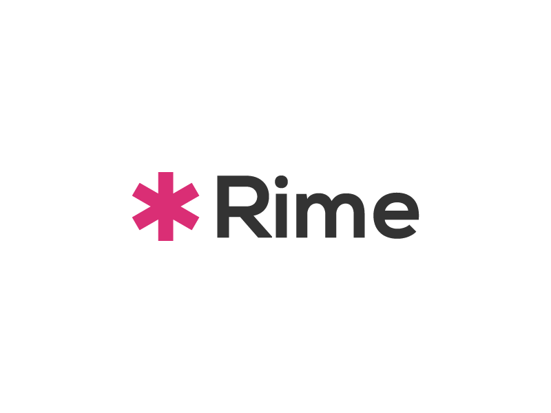

# Rime


### Glyph ✱ 
```
Menlo Regular
HEAVY ASTERISK
Unicode: U+2731, 
UTF-8: E2 9C B1 
```


### Typeface [Nexa Bold](http://www.fontfabric.com/nexa-free-font/) 80% Opacity


### Primary Color #[DA2E75](https://www.google.co.in/search?q=%23DA2E75)

 
